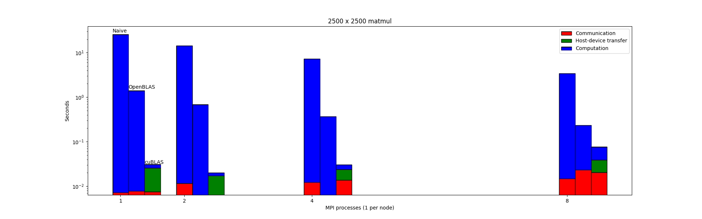
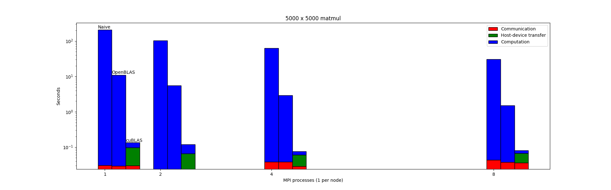

# Parallel programming for HPC
Weekly exercises for the course in _Parallel programming for HPC_ @ UniTS.

## Topics
- MPI
- OpenMP
- Theory of GPU programming
- CUDA
- OpenACC

## Some plots
The following time measurements were taken on standard nodes on [Marconi-100](https://wiki.u-gov.it/confluence/pages/viewpage.action?pageId=336727645).

### MatMul
Distributed matrix multiplication ([matmul](matmul)) with MPI, BLAS and cuBLAS.

*2500x2500*

*5000x5000*

